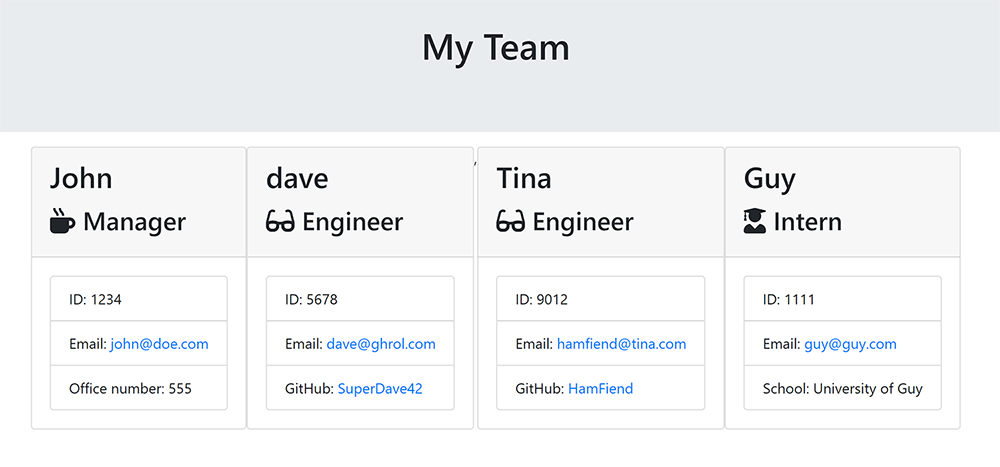

# Team Manager

## Description 

A team builder that runs in the terminal. It will ask you questions on which member you want to add. Then you are presented with a series of questions for each role. After you are done, it will then generate a styled html file for you to easily access your team members information.

## Table of Contents

* [Usage](#usage)
* [Tests](#tests)
* [Questions](#questions)

## Usage 

When you first run it, you will be prompted in the terminal about the managers info of the team. Then it will ask which member you would like to add. Once you have picked which memberm then you will be asked a series of questions about that individual member. 

After you are done with those, then the terminal will take you back to the add members prompt.

Once you are done, just hit 'All Done'. It will then generate your information into a styled HTML document for easy access your team members information.

## Tests

There is an example html document in the output folder ready for viewing.

## Questions

If you have any questions please contact me at:

Email: samuelfoster0@gmail.com

